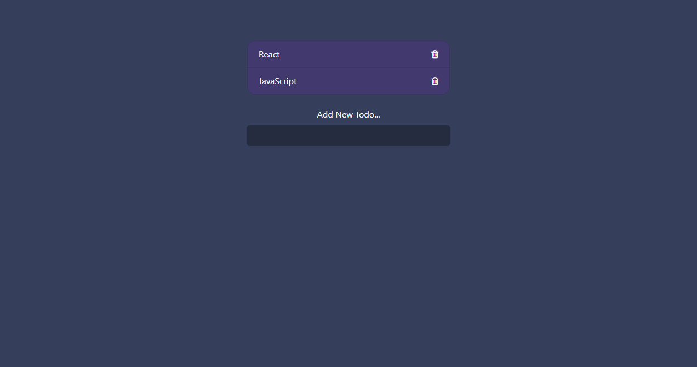

<div align="center">

# ✅ To-Do List
### Simple & Minimal Task Manager

<!-- Preview Image -->



<br/><br/>


</div>

---

## 📌 About The Project

This is a **simple and minimal To-Do List application** built with **Vanilla JavaScript**.  
It helps users manage daily tasks with a clean interface and distraction-free experience.

The main goal of this project is to practice **DOM manipulation**, **event handling**, and **clean UI design**.

---

## ✨ Features

- ➕ Add new tasks  
- 🗑 Remove tasks  
- ✅ Mark tasks as completed  
- 💾 Persistent data (Local Storage)  
- 🧼 Minimal & user-friendly UI  

---

## 🛠 Tech Stack

| Technology | Purpose |
|----------|--------|
| HTML5 | Structure |
| CSS3 | Styling |
| JavaScript (ES6+) | Logic & interactivity |

---

## 📂 Project Structure

```bash
├─ css
│  └─ style.css
├─ index.html
├─ js
│  └─ script.js
├─ LICENSE
└─ README.md

```